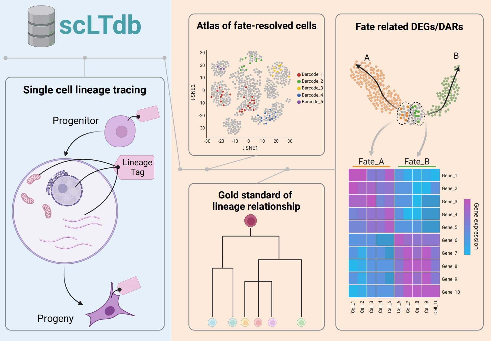
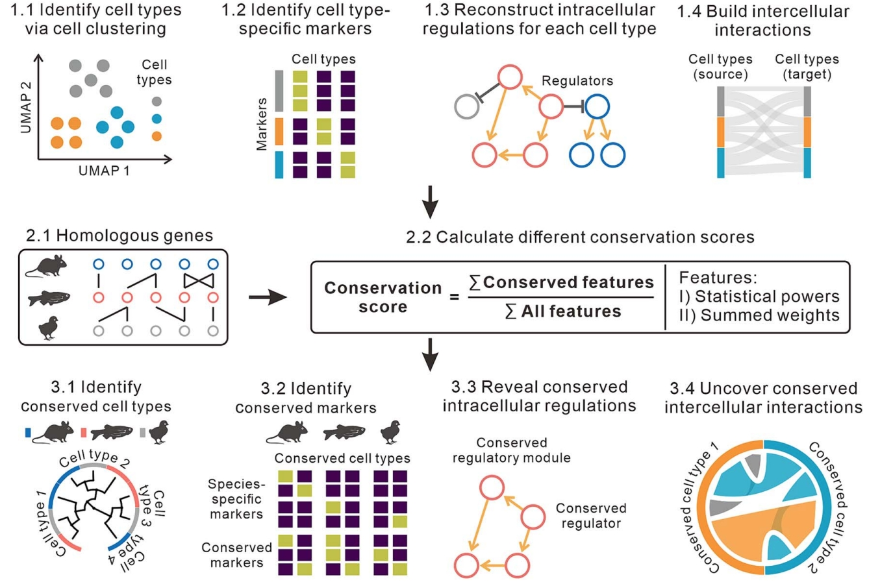

I am a PhD Candidate in Bioinformatics at the School of Life Sciences, Westlake University. I was a former Research Assistant from Jie Wang Lab at Guangzhou Institutes of Biomedicine and Health (GIBH), Chinese Academy of Sciences.

My research focus primarily revolves around the application of statistical and machine learning methods to omics data, specifically single-cell and spatial genomics. I have developed several computational approaches to decipher gene regulations and cross-species conservation. Additionally, I am eager to analyze complex omics data to gain insights into embryonic development and the heterogeneity of cancer.

I am also an amateur bodybuilder with 120KG maximal weight for bench press, 180KG maximal weight for Deadlift, and 170KG maximal weight for Squat.

**Research Keywords:** single cell & spatial genomics, machine learning, system biology
**Advocacy:** equality, freedom

***

# Research experience in Bioinformatics/Comp Bio

Phd Candidate in **Computional biology** at [Westlake University](https://www.westlake.edu.cn). 2022.08-present (I will comment this experience after i earn PHD degree (if possible?))
- Apply machine learning and statistic methods on single cell multiomics & spatial genomics data
- Using single cell lineage tracing technolog to study embroy development
- ......

Research Assistant at [Guangzhou Institutes of Biomedicine and Health, Chinese Academy of Sciences](http://english.gibh.cas.cn/). 2021.03-2022.06 (Get computational biology training here, with great gratitude to Professor [Jie Wang](https://jiewanglab.github.io/us/))
- Develop IReNA to reconstruct GRN based on single cell multiomics data
- Develop CACIMAR to perform cross-species analysis based on scRNA-seq data
- Analyze DNA methylation and scRNA-seq data to study hepatic carcinoma.

Bioinformatician Intern at [Singleron Biotech](https://singleron.bio/). 2020.12-2021.02 (Just run pipeline, boring......)
- Integrate large scale public scRNA-seq data to evaluate PBMC immu cell functions
- Develop fast single cell multiomics data analysis pipeplines.

Master in **Genomics & Bioinformatics** at [Chinese University of Hong Kong](https://www.cuhk.edu.hk/chinese/index.html). 2020.09-2021.11 (Where my bioinformatics journey begin)
- Analyze whole genome sequencing data to study bacteria evolution
- Analyze bulk and single cell RNA-seq data to study hepatic carcinoma, advised by [Prof TSUI Kwok Wing](https://www2.sbs.cuhk.edu.hk/en-gb/people/academic-staff/prof-tsui-kwok-wing-stephen). 

***

# Selected Publications

*: co-first, #: correspondence

 
<ul>

<table class="imgtable"><tr><td>
    &nbsp;</td>
    <td align="left">

        <b><a href= "" target="_blank" style="color:#2a7ce0">scLTdb: a comprehensive single cell lineage tracing database</a></b> 
        <i> <b>Junyao Jiang*</b>, Xing Ye*, Yunhui Kong*, Chenyu Guo, Mingyuan Zhang, Fang Cao, Yanxiao Zhang#, Weike Pei# </a></i> <i><b>Nucleic Acids Research 2024 IF 16.6</b></i> 
        <b>Keywords: Single cell genomics, Lineage tracing, Cell fate</b> 

</td></tr></table>

<table class="imgtable"><tr><td>
    &nbsp;</td>
    <td align="left">

        <b><a href= "https://academic.oup.com/bib/article/25/4/bbae283/7690342" target="_blank" style="color:#2a7ce0">CACIMAR: cross-species analysis of cell identities, markers, regulations, and interactions using single-cell RNA sequencing data</a></b> 
        <i> <b>Junyao Jiang*</b>, Jinlian Li*, Sunan Huang, Fan Jiang, Yanran Liang, Xueli Xu#, Jie Wang# </a></i> <i><b>Briefing in Bioinformatics June 2024 IF 9.5</b></i> 
        <b>Keywords: Single cell genomics, Cross-species analysis</b> 

</td></tr></table>

</ul>

**Junyao Jiang**\*, Pin Lyu\*, Jinlian Li\*, Sunan Huang, Jiawang Tao, Seth Blackshaw, Qian Jiang, Jie Wang. IReNA: Integrated Regulatory Network Analysis of Single-Cell Transcriptomes and Chromatin Accessibility Profiles. ***iscience***, Oct 2022 (Impact factor 6.1)

+ single cell genomics; gene regulatory networks

Ying Xin\*, Pin Lyu\*, **Junyao Jiang**, Fengquan Zhou, Jie Wang, Seth Blackshaw, Jiang Qian. LRLoop: Feedback loops as a design principle of cell-cell communication. ***Bioinformatics***, July 2022

+ single cell genomics; cell-cell communications

$\mit{Web}$ $\mit{tools}$ $\mit{and}$ $\mit{database}$

**Junyao Jiang**\*, Xing Ye\*, Yunhui Kong\*, Chenyu Guo, Mingyuan Zhang, Fang Cao, Yanxiao Zhang#, Weike Pei#. scLTdb: a comprehensive single cell lineage tracing database. ***Nucleic Acids Research***, Oct 2024 (Accepted) (Impact factor 16.6)

+ single cell genomics; lineage tracing; cell fate

$\mit{Data}$ $\mit{analysis}$

Dapeng Sun\*, Xiaojie Gan\*, Lei Liu\*, Yuan Yang\*, Dongyang Ding, Wen Li, **Junyao Jiang**, et al. DNA hypermethylation modification promotes the development of hepatocellular carcinoma by depressing the tumor suppressor gene ZNF334. ***Cell Death & Disease***, May 2022

***

# Maintained Software
+ [IReNA]() Consturct gene regualtory networks based on single cell multiomics data
+ [CACIMAR]() scRNA-seq based cross-species data analysis
+ [FateMapper]() single cell lineage tracing data analysis and visualization
+ [scLTdb]() Database for single cell lineage tracing

