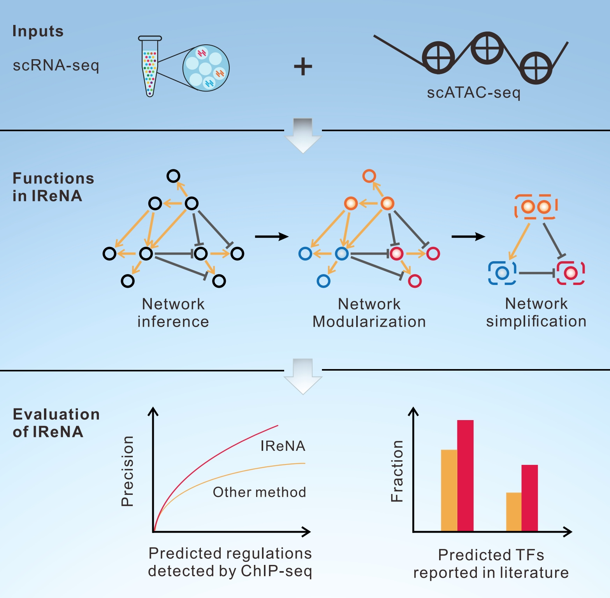

I am a Ph.D Candidate in Biology (Computional Biology) at the School of Life Sciences, Westlake University, advised by [Prof Weike Pei](https://www.westlake.edu.cn/faculty/weike-pei.html) & [Prof Yanxiao Zhang](https://www.westlake.edu.cn/faculty/yanxiao-zhang.html). My research focuses on integrating statistical and machine learning methods with single-cell lineage tracing to decode the cell fate decision process. Before joining Westlake, I developed algorithms for single-cell multi-omics data analysis and network inference at [Jie Wang's lab](https://jiewanglab.github.io/us/news.html) in GIBH-CAS.

I am also an amateur bodybuilder with 127.5KG maximal weight for bench press, 185KG maximal weight for Deadlift, and 170KG maximal weight for Squat.

***

## 📡 Research Interset

- Developing computational tools for single-cell genomics and spatial genomics
- Constructing large-scale cell atlas based on cutting-edge sequencing technologies
- Investigating regulatory mechanisms in cell fate decision and disease occurrence

***

## 🚩 Professional Experience in Computional Biology

- Ph.d Candidate in **Biology (Computional Biology)** at [Westlake University](https://www.westlake.edu.cn). 2022.08-present 

- Research Assistant at [Guangzhou Institutes of Biomedicine and Health, Chinese Academy of Sciences](http://english.gibh.cas.cn/). 2021.03-2022.06 (Get computational biology training here, with great gratitude to Professor [Jie Wang](https://jiewanglab.github.io/us/))

- Bioinformatician Intern at [Singleron Biotech](https://singleron.bio/). 2020.12-2021.02 (Just run pipeline, boring......)

- Master in **Genomics & Bioinformatics** at [Chinese University of Hong Kong](https://www.cuhk.edu.hk/chinese/index.html). 2020.09-2021.11 (Where my bioinformatics journey begin)

***

## 📝 Selected Publications

*: co-first, #: correspondence

<ul>

<table class="imgtable"><tr><td>
    &nbsp;</td>
    <td align="left">

        <b><a href= "" target="_blank" style="color:#2a7ce0">scLTdb: a comprehensive single cell lineage tracing database</a></b> 
        <i> <b>Junyao Jiang*</b>, Xing Ye*, Yunhui Kong*, Chenyu Guo, Mingyuan Zhang, Fang Cao, Yanxiao Zhang#, Weike Pei# </i> <i><b>Nucleic Acids Research, Oct 2024, IF 16.6</b></i> 
        <b>Keywords: Single cell genomics, Lineage tracing, Cell fate</b> 

</td></tr></table>

<table class="imgtable"><tr><td>
    &nbsp;</td>
    <td align="left">

        <b><a href= "https://academic.oup.com/bib/article/25/4/bbae283/7690342" target="_blank" style="color:#2a7ce0">CACIMAR: cross-species analysis of cell identities, markers, regulations, and interactions using single-cell RNA sequencing data</a></b> 
        <i> <b>Junyao Jiang*</b>, Jinlian Li*, Sunan Huang, Fan Jiang, Yanran Liang, Xueli Xu#, Jie Wang# </i> <i><b>Briefing in Bioinformatics, June 2024, IF 9.5</b></i> 
        <b>Keywords: Single cell genomics, Cross-species analysis</b> 

</td></tr></table>

<table class="imgtable"><tr><td>
    &nbsp;</td>
    <td align="left">

        <b><a href= "https://www.cell.com/iscience/pdf/S2589-0042(22)01631-5.pdf" target="_blank" style="color:#2a7ce0">IReNA: Integrated Regulatory Network Analysis of Single-Cell Transcriptomes and Chromatin Accessibility Profiles</a></b> 
        <i> <b>Junyao Jiang*</b>, Pin Lyu*, Sunan Huang, Jiawang Tao, Seth Blackshaw, Qian Jiang, Jie Wang</i> <i><b>iscience, Oct 2022, IF 6.1</b></i> 
        <b>Keywords: Single cell genomics, Gene regulatory network</b> 

</td></tr></table>

</ul>

***

## 📝 Other Publications

Yunhui Kong\*, **Junyao Jiang**\*,#, Weikang Kong, Sheng Qin#. DRCTdb: disease-related cell type analysis to decode cell type effect and underlying regulatory mechanisms. ***Communications Biology***, Sep 2024 (Co-first & Co-correspondence)

Ying Xin\*, Pin Lyu\*, **Junyao Jiang**, Fengquan Zhou, Jie Wang, Seth Blackshaw, Jiang Qian. LRLoop: Feedback loops as a design principle of cell-cell communication. ***Bioinformatics***, July 2022

Dapeng Sun\*, Xiaojie Gan\*, Lei Liu\*, Yuan Yang\*, Dongyang Ding, Wen Li, **Junyao Jiang**, et al. DNA hypermethylation modification promotes the development of hepatocellular carcinoma by depressing the tumor suppressor gene ZNF334. ***Cell Death & Disease***, May 2022

***

## 🀄 Award

+ 2024 National Scholarship (~4500 USD)

***

## 💻 Maintained Software
+ [IReNA](https://github.com/jiang-junyao/IReNA) Consturct gene regualtory networks based on single cell multiomics data
+ [CACIMAR](https://github.com/jiang-junyao/CACIMAR) scRNA-seq based cross-species data analysis
+ [FateMapper](https://github.com/jiang-junyao/FateMapper) single cell lineage tracing data analysis and visualization
+ [scLTdb](https://scltdb.com) Database for single cell lineage tracing
+ [FateExplorer](https://github.com/jiang-junyao/FateExplorer) Machine learning method to generate clone embedding and perform fate analysis

***

## 📛 Mentorship

**Xing Ye**: Undergraduate from University of Science and Technology of China, 2023.11-2024.06. (Co-first author at scLTdb project)

***

## 📞 Peer Review Service

Communications Biology; BMC Bioinformatics; Scientific Reports

